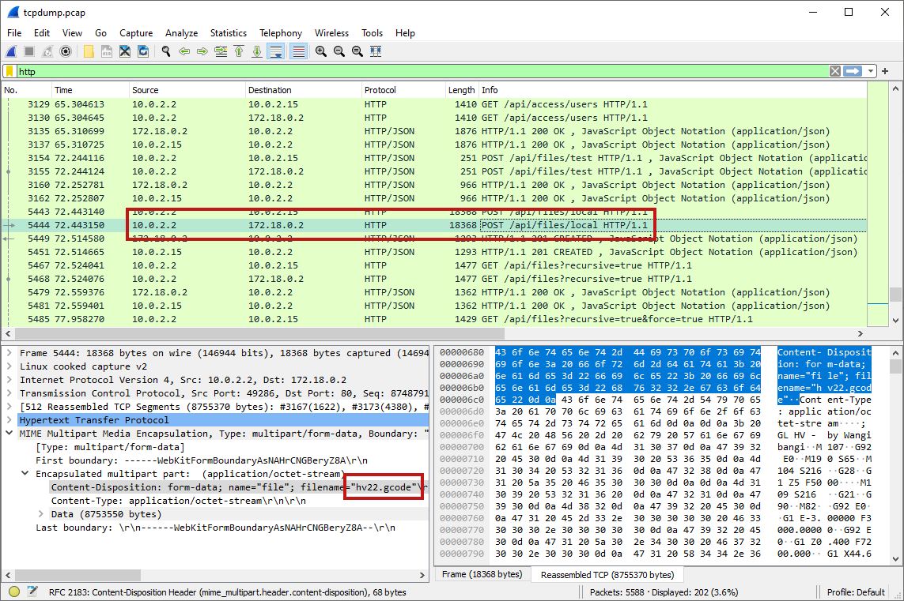
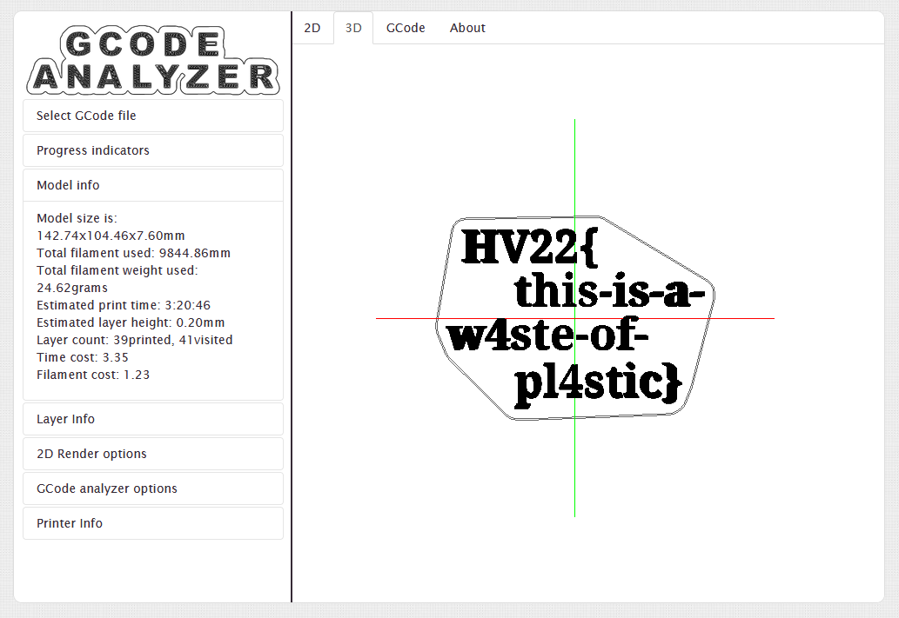

# [HV22.05] Missing gift

- First of all, let's open the dump with [Wireshark](https://www.wireshark.org/).
- We notice a bunch of traffic, but what's interesting is near the end: non-encrypted HTTP requests to a local website that seems to a local instance of [OctoPrint](https://octoprint.org/).
- A file called `hv22.gcode` was uploaded to that website!

- We export the file using `right click -> export packet bytes` on the data field.
- This is a [G-code](https://en.wikipedia.org/wiki/G-code) file, which is a standard format for 3D printing.
- We can open this file in any G-code viewer, like https://gcode.ws/.
- Opening the file shows us the flag.

