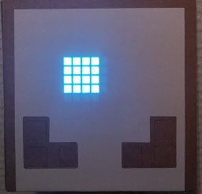
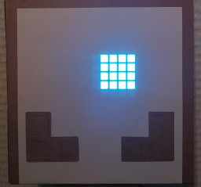
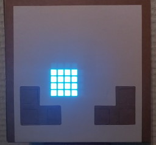
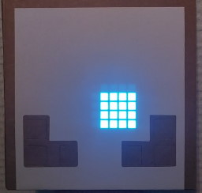
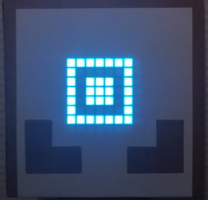
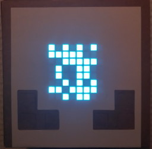
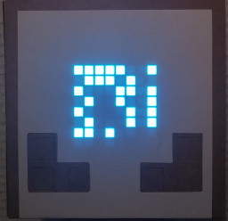
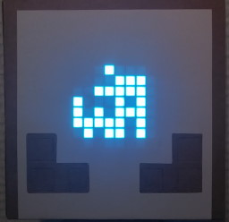
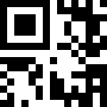

# [HV22.07] St. Nicholas's animation

Excluding the colorful _Oxocard Blockly_ animations, the video displays four squares (top-left, top-right, bottom-left,
bottom-right), then four parts of what seems to be a QR code.

## Frames 1-4

## Frames 5-8

If we combine these four parts, we get a [Micro QR Code](https://en.wikipedia.org/wiki/QR_code#Micro_QR_code).

Parsing this micro QR code gives the flag.
